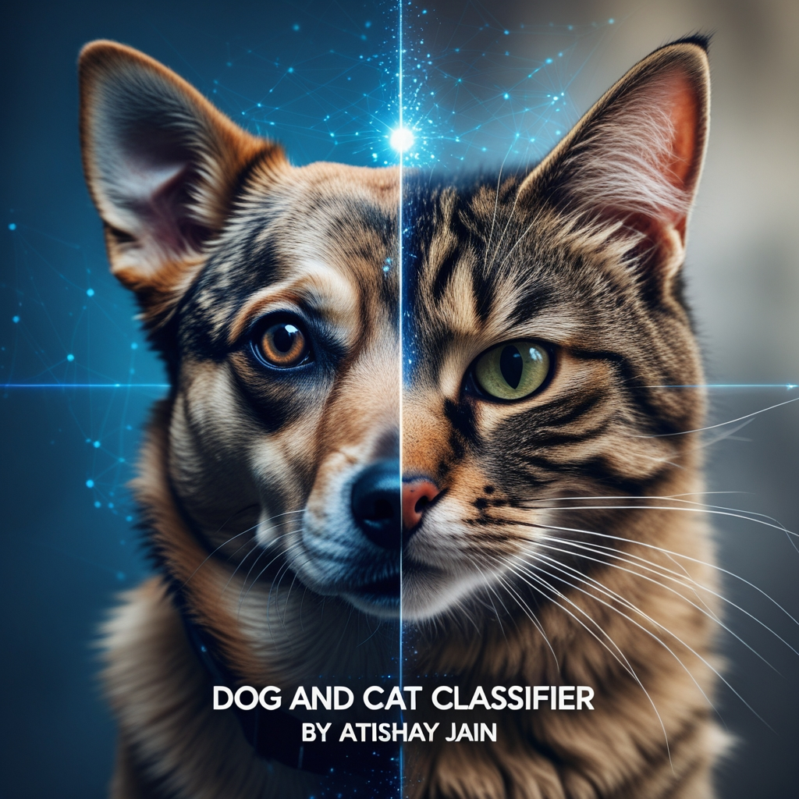

# Dog and Cat Classifier
◦ Built an image classification model to distinguish between dog and cat images using Convolutional Neural Networks (CNNs).
 
◦ Leveraged transfer learning with the pre-trained VGG16 model for feature extraction and fine-tuning by training it’s block 5.
 
◦ Achieved a remarkable 95.7% accuracy on unseen data by optimizing the model using advanced techniques.
 
◦ Preprocessed the dataset using data augmentation and normalization to improve model robustness.

